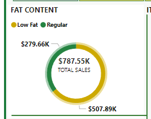

# Blinkit Sales Analysis Dashboard

This repository contains a Power BI dashboard designed to analyze Blinkit's sales performance, customer satisfaction, and inventory distribution. The primary objective is to gain actionable insights using various Key Performance Indicators (KPIs) and visualizations, with the goal of optimizing business strategies for Blinkit.

## Problem Statement

Blinkit, a leading online retailer, is looking to optimize its sales performance, customer satisfaction, and inventory distribution by gaining actionable insights from its data. The goal of this project is to create a comprehensive dashboard that will help identify key trends, patterns, and opportunities for improvement. Through the analysis of various KPIs and visualizations, Blinkit aims to make data-driven decisions to:

- **Maximize Revenue**: By analyzing total sales, revenue per sale, item performance, and customer satisfaction, Blinkit can improve its sales strategy.
- **Improve Customer Satisfaction**: The analysis will reveal how customer ratings correlate with sales performance, helping Blinkit identify areas for improvement.
- **Optimize Inventory Distribution**: By examining how inventory characteristics (such as fat content, outlet size, and location) affect sales, Blinkit can streamline its inventory management.
- Screenshot 2024-11-24 112003.png

## Business Requirements

The dashboard provides a comprehensive analysis of the following:

- **Sales Performance**: Evaluate total sales across different dimensions (fat content, item type, etc.).
- **Customer Satisfaction**: Measure customer ratings and how they correlate with total sales and other KPIs.
- **Inventory Distribution**: Assess how inventory types, fat content, outlet sizes, and locations influence total sales.

## Key Performance Indicators (KPIs)

The following KPIs are tracked in the dashboard:

1. **Total Sales**: Overall revenue generated from all items sold.
2. **Average Sales**: The average revenue per sale.
3. **Number of Items**: The total count of different items sold.
4. **Average Rating**: The average customer rating for items sold.

## Visualizations and Charts

The following charts and visualizations are included in the Power BI dashboard to analyze these KPIs:

### 1. Total Sales by Fat Content
- **Objective**: Analyze the impact of fat content on total sales.
- **KPI Metrics**: In addition to total sales, this chart assesses how Average Sales, Number of Items, and Average Rating vary with fat content.
- **Chart Type**: Donut Chart.




### 2. Total Sales by Item Type
- **Objective**: Identify the performance of different item types in terms of total sales.
- **KPI Metrics**: Similar to the previous chart, this one examines Average Sales, Number of Items, and Average Rating by item type.
- **Chart Type**: Bar Chart.


### 3. Fat Content by Outlet for Total Sales
- **Objective**: Compare total sales across different outlets segmented by fat content.
- **KPI Metrics**: This chart evaluates how Average Sales, Number of Items, and Average Rating vary by fat content for each outlet.
- **Chart Type**: Stacked Column Chart.


### 4. Total Sales by Outlet Establishment
- **Objective**: Evaluate how the age or type of outlet establishment influences total sales.
- **Chart Type**: Line Chart.


### 5. Sales by Outlet Size
- **Objective**: Analyze the correlation between outlet size and total sales.
- **Chart Type**: Donut/Pie Chart.


### 6. Sales by Outlet Location
- **Objective**: Assess the geographic distribution of sales across different locations.
- **Chart Type**: Funnel Map.


### 7. All Metrics by Outlet Type
- **Objective**: Provide a comprehensive view of all key metrics (Total Sales, Average Sales, Number of Items, Average Rating) broken down by different outlet types.
- **Chart Type**: Matrix Card.


## Getting Started

### Prerequisites

To use and explore the Power BI dashboard, you will need:

- **Power BI Desktop** or **Power BI Service** to open and interact with the report.
- **Data Source**: A CSV file or database connection containing Blinkit's sales, customer, and outlet data.

### Installation

Follow these steps to set up the dashboard:

1. **Clone the repository**:
   ```bash
   git clone https://github.com/your-username/blinkit-sales-analysis.git

